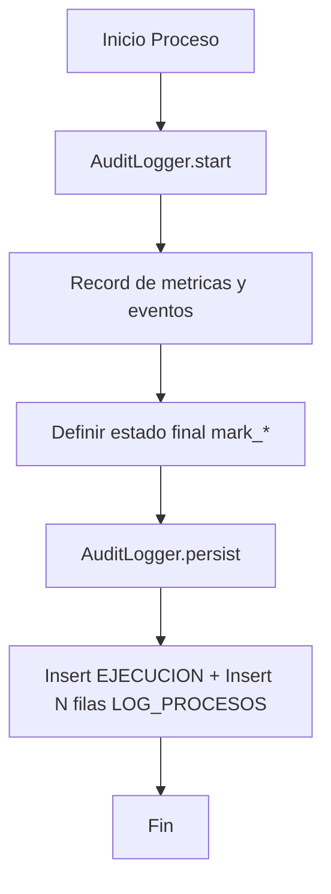

# Documentacion: Sistema de Auditoria de Automatizaciones

## Indice rapido

- [Objetivo](#objetivo)
- [Modelo de datos](#modelo-de-datos)
- [DDL completo recomendado](#ddl-completo-recomendado)
- [Purga automatica por lotes](#purga-automatica-por-lotes)
- [Contrato tecnico de auditoria](#contrato-tecnico-de-auditoria)
- [Convencion de detalle](#convencion-de-detalle)
- [Flujo de auditoria](#flujo-de-auditoria)
- [Manejo de errores](#manejo-de-errores)
- [Queries utiles](#queries-utiles)

## Objetivo

Estandarizar la trazabilidad de todas las automatizaciones en una infraestructura unica de auditoria.

Beneficios:

- Centraliza ejecuciones y detalle operativo por proceso.
- Reduce dependencia de logs locales dispersos.
- Mejora soporte, debugging y analisis historico.

## Modelo de datos


La auditoria se organiza en tres niveles:

1. `PROCESOS`: catalogo de procesos.
2. `EJECUCION`: cada corrida de un proceso.
3. `LOG_PROCESOS`: detalle de lo ocurrido en la corrida.

### PROCESOS

- Identifica en forma unica cada automatizacion.
- Campos esperados: `id_proceso`, `nombre_proceso`, `descripcion_proceso`.

Ejemplo:

| id_proceso | nombre_proceso | descripcion_proceso                                   |
| ---------- | -------------- | ----------------------------------------------------- |
| 1          | ETL_SEGUROS    | Sincroniza operaciones de seguros hacia Google Sheets |
| 2          | STOCK_WEB      | Publica stock de unidades en portal web               |

### EJECUCION

- Registra inicio, fin, resumen y estado final de cada corrida.
- Estados validos: `EXITO`, `ADVERTENCIA`, `ERROR`.

Ejemplo:

| id_ejecucion | id_proceso | fecha_inicio        | fecha_fin           | resumen                                                                 | estado      |
| ------------ | ---------- | ------------------- | ------------------- | ----------------------------------------------------------------------- | ----------- |
| 1001         | 1          | 2026-04-10 17:13:19 | 2026-04-10 17:13:23 | deduplicados=10, inserts=10, updates=0, deletes=0, warnings=0, errors=0 | EXITO       |
| 1002         | 1          | 2026-04-10 17:18:10 | 2026-04-10 17:18:14 | deduplicados=5, inserts=3, updates=2, deletes=0, warnings=1, errors=0   | ADVERTENCIA |

### LOG_PROCESOS

- Almacena el detalle textual estructurado de una ejecucion.
- Relacion: `LOG_PROCESOS.id_ejecucion -> EJECUCION.id_ejecucion`.

Importante:

- No se garantiza una sola fila por ejecucion.
- El detalle puede dividirse en multiples filas por chunking (`max_chunk_chars`).
- Todas las filas pertenecen al mismo `id_ejecucion`.

## DDL completo recomendado

La siguiente definicion incluye:

- Integridad referencial entre `log_procesos` y `ejecucion`.
- `ON DELETE CASCADE` para simplificar purga.
- Indices de consulta frecuentes.

```sql
CREATE TABLE `procesos` (
  `id_proceso` int unsigned NOT NULL AUTO_INCREMENT,
  `nombre_proceso` varchar(100) CHARACTER SET utf8mb4 COLLATE utf8mb4_unicode_ci NOT NULL,
  `descripcion_proceso` text CHARACTER SET utf8mb4 COLLATE utf8mb4_unicode_ci,
  PRIMARY KEY (`id_proceso`),
  UNIQUE KEY `uq_procesos_nombre` (`nombre_proceso`)
) ENGINE=InnoDB DEFAULT CHARSET=utf8mb4 COLLATE=utf8mb4_unicode_ci;

CREATE TABLE `ejecucion` (
  `id_ejecucion` bigint unsigned NOT NULL AUTO_INCREMENT,
  `id_proceso` int unsigned NOT NULL,
  `fecha_inicio` datetime(3) NOT NULL,
  `fecha_fin` datetime(3) DEFAULT NULL,
  `resumen` varchar(255) CHARACTER SET utf8mb4 COLLATE utf8mb4_unicode_ci DEFAULT NULL,
  `estado` enum('EXITO','ERROR','ADVERTENCIA') CHARACTER SET utf8mb4 COLLATE utf8mb4_unicode_ci NOT NULL,
  PRIMARY KEY (`id_ejecucion`),
  KEY `idx_ejecucion_estado_fecha` (`estado`,`fecha_inicio`) USING BTREE,
  KEY `idx_ejecucion_proceso_fecha` (`id_proceso`,`fecha_inicio`) USING BTREE,
  CONSTRAINT `fk_ejecucion_proceso`
    FOREIGN KEY (`id_proceso`) REFERENCES `procesos` (`id_proceso`)
) ENGINE=InnoDB DEFAULT CHARSET=utf8mb4 COLLATE=utf8mb4_unicode_ci;

CREATE TABLE `log_procesos` (
  `id_log` bigint unsigned NOT NULL AUTO_INCREMENT,
  `id_ejecucion` bigint unsigned NOT NULL,
  `detalle` mediumtext CHARACTER SET utf8mb4 COLLATE utf8mb4_unicode_ci NOT NULL,
  `orden_bloque` int DEFAULT NULL,
  PRIMARY KEY (`id_log`),
  KEY `idx_log_ejecucion` (`id_ejecucion`) USING BTREE,
  CONSTRAINT `fk_log_procesos_ejecucion`
    FOREIGN KEY (`id_ejecucion`) REFERENCES `ejecucion` (`id_ejecucion`) ON DELETE CASCADE
) ENGINE=InnoDB DEFAULT CHARSET=utf8mb4 COLLATE=utf8mb4_unicode_ci;
```

## Purga automatica por lotes

Politica sugerida:

- `EXITO`: conservar 90 dias.
- `ADVERTENCIA`: conservar 180 dias.
- `ERROR`: conservar 365 dias.

La purga se ejecuta por lotes para evitar locks largos.

```sql
DELIMITER $$

DROP PROCEDURE IF EXISTS `sp_purge_auditoria_por_lotes` $$
CREATE PROCEDURE `sp_purge_auditoria_por_lotes`(
    IN p_batch_size INT,
    IN p_keep_days_exito INT,
    IN p_keep_days_advertencia INT,
    IN p_keep_days_error INT
)
BEGIN
    DECLARE v_rows INT DEFAULT 0;
    DECLARE v_batch_size INT DEFAULT 5000;

    IF p_batch_size IS NOT NULL AND p_batch_size > 0 THEN
        SET v_batch_size = p_batch_size;
    END IF;

    purge_loop: LOOP
        DELETE e
        FROM ejecucion e
        WHERE (
            (e.estado = 'EXITO' AND e.fecha_inicio < NOW() - INTERVAL p_keep_days_exito DAY)
            OR (e.estado = 'ADVERTENCIA' AND e.fecha_inicio < NOW() - INTERVAL p_keep_days_advertencia DAY)
            OR (e.estado = 'ERROR' AND e.fecha_inicio < NOW() - INTERVAL p_keep_days_error DAY)
        )
        ORDER BY e.id_ejecucion
        LIMIT v_batch_size;

        SET v_rows = ROW_COUNT();

        IF v_rows = 0 THEN
            LEAVE purge_loop;
        END IF;
    END LOOP;
END $$

DELIMITER ;
```

Crear evento diario (opcional, si usan `event_scheduler`):

```sql
CREATE EVENT IF NOT EXISTS `auditoria-automatizaciones`.`ev_limpieza_auditoria`
ON SCHEDULE EVERY 1 DAY
STARTS (TIMESTAMP(CURRENT_DATE) + INTERVAL 3 HOUR) -- Se ejecutará a las 3:00 AM
DO
    -- PRIMER PARAMETRO REPRESENTA TAMAÑO LOTE, VA A ELIMINAR 5000 REGISTROS A LA VEZ EN VEZ DE BORRAR TODO JUNTO
    -- SEGUNDO CORRESPONDE CUANTOS DÍAS PASARON DESDE QUE CORRIO EL REGISTRO EXITO
    -- TERCERO CUANTOS DÍAS PASARON DESDE QUE CORRIO REGISTRO ADVERTENCIA
    -- CUARTO CUANTOS DÍAS PASARON DESDE QUE CORRÍO REGISTRO ERROR -> SI PASARON MÁS DE ESE NUMERO SE BORRA
  CALL `auditoria-automatizaciones`.`sp_purge_auditoria_por_lotes`(5000, 60, 100, 100);
```

## Contrato tecnico de auditoria

Fuente de verdad: `core/audit_logger.py`.

Ciclo de vida:

`start -> record_* / set_metric -> mark_* -> persist`

### Metodos principales

- `start()`: inicia `fecha_inicio`.
- `set_metric(name, value)`: agrega metrica al resumen.
- `record_info(message)`: agrega informacion operativa.
- `record_insert(entity_ids)`: registra ids insertados.
- `record_update(entity_id, changes)`: registra update por entidad + detalle por campo.
- `record_delete(entity_ids)`: registra ids eliminados (si aplica).
- `record_warning(message)`: registra warning.
- `record_error(message)`: registra error.
- `record_detail_line(line)`: agrega lineas custom (ej: `SOURCE_*`).
- `mark_success() | mark_warning() | mark_error()`: define estado final explicito.
- `persist()`: inserta `EJECUCION` y `LOG_PROCESOS` en transaccion.

### Reglas de estado

- Si se usa `mark_success()`: estado `EXITO`.
- Si se usa `mark_warning()`: estado `ADVERTENCIA`.
- Si se usa `mark_error()`: estado `ERROR`.
- Si no se marca estado:
  - con warnings/errors registrados: `ADVERTENCIA`.
  - sin warnings/errors: `EXITO`.

### Politica de persistencia de detalle (`LOG_PROCESOS`)

- Siempre se persiste `EJECUCION`.
- `LOG_PROCESOS` se persiste siempre para `ADVERTENCIA` y `ERROR`.
- Para `EXITO`, se persiste `LOG_PROCESOS` solo si hubo datos relevantes:
  - inserts (`[INSERT]`), o
  - updates (`[UPDATE]`), o
  - deletes (`[DELETE]`), o
  - warnings/errors registrados.
- Para `EXITO` sin datos relevantes (sin inserts/updates/deletes/warnings/errors), no se insertan filas en `LOG_PROCESOS` para reducir ruido y crecimiento innecesario.

### Formato de resumen

`resumen` se compone con metricas `k=v` y contadores estructurales:

- `inserts`, `updates`, `deletes`, `warnings`, `errors`.

Ejemplo:

`deduplicados=218, extraidos=269, noop=0, inserts=218, updates=0, deletes=0, warnings=0, errors=0`

## Convencion de detalle

El campo `detalle` debe mantener etiquetas consistentes para lectura humana y analisis posterior.

Etiquetas recomendadas:

- `[INICIO]` inicio de corrida
- `[RESUMEN]` resumen global
- `[INFO]` informacion relevante de ejecucion
- `[SOURCE_START]` inicio de extraccion por host/sucursal
- `[SOURCE_SUMMARY]` resumen por fuente
- `[SOURCE_ERROR]` error operativo por fuente
- `[INSERT]` ids insertados
- `[UPDATE]` ids actualizados
- `[DELETE]` ids eliminados
- `[WARNING]` warnings de negocio/operacion
- `[ERROR]` errores detectados
- `[FIN]` estado final y timestamp de cierre

Ejemplo de detalle:

```text
[INICIO] 2026-04-29 11:39:06
[RESUMEN] deduplicados=218, extraidos=269, noop=0, inserts=218, updates=0, deletes=0, warnings=0, errors=0
[INFO] Modo de ejecucion=PRODUCCION, Rango productivo aplicado: FechaPrereserva desde=20260201 hasta=20260301 origen=PARAMETROS
[SOURCE_START] host_group=1 host=192.168.1.77 sucursales=FORD,HYUNDAI databases=ProyautMonti,ProyautAuto rango=20260201->20260301
[SOURCE_SUMMARY] host_group=1 host=192.168.1.77 sucursal=FORD database=ProyautMonti extraidos=94
[INSERT] 26020001|FORD, 26020001|FIAT, 26020001|JEEP
[FIN] EXITO | 2026-04-29 11:39:12
```

## Flujo de auditoria



## Manejo de errores

La estrategia vigente no aplica rollback funcional del negocio por defecto.

En caso de falla parcial:

- Los cambios exitosos ya aplicados se conservan.
- Los errores se registran en `LOG_PROCESOS.detalle`.
- El estado final debe reflejar el resultado real (`ADVERTENCIA` o `ERROR`).

## Queries utiles

### Ejecuciones recientes

```sql
SELECT
    p.nombre_proceso,
    e.id_ejecucion,
    e.fecha_inicio,
    e.fecha_fin,
    e.estado,
    e.resumen
FROM ejecucion e
JOIN procesos p ON e.id_proceso = p.id_proceso
ORDER BY e.fecha_inicio DESC
LIMIT 100;
```

### Ejecuciones con error

```sql
SELECT
    p.nombre_proceso,
    e.id_ejecucion,
    e.fecha_inicio,
    e.fecha_fin,
    e.estado,
    e.resumen
FROM ejecucion e
JOIN procesos p ON e.id_proceso = p.id_proceso
WHERE e.estado = 'ERROR'
ORDER BY e.fecha_inicio DESC;
```

### Ejecuciones con advertencia

```sql
SELECT
    p.nombre_proceso,
    e.id_ejecucion,
    e.fecha_inicio,
    e.fecha_fin,
    e.estado,
    e.resumen
FROM ejecucion e
JOIN procesos p ON e.id_proceso = p.id_proceso
WHERE e.estado = 'ADVERTENCIA'
ORDER BY e.fecha_inicio DESC;
```

### Detalle completo de una ejecucion (chunk-aware)

```sql
SELECT
    l.id_log,
    l.id_ejecucion,
    l.orden_bloque,
    l.detalle
FROM log_procesos l
WHERE l.id_ejecucion = 1
ORDER BY COALESCE(l.orden_bloque, 2147483647), l.id_log ASC;
```

Reemplazar `1` por el `id_ejecucion` a auditar.

Nota:

- Puede haber ejecuciones validas sin filas en `LOG_PROCESOS` cuando el estado es `EXITO` sin datos relevantes (politica de compactacion).

### Duracion de ejecuciones

```sql
SELECT
    p.nombre_proceso,
    e.id_ejecucion,
    e.fecha_inicio,
    e.fecha_fin,
    TIMESTAMPDIFF(SECOND, e.fecha_inicio, e.fecha_fin) AS duracion_segundos,
    e.estado
FROM ejecucion e
JOIN procesos p ON e.id_proceso = p.id_proceso
WHERE e.fecha_fin IS NOT NULL
ORDER BY e.fecha_inicio DESC;
```
