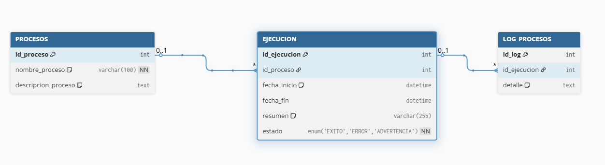
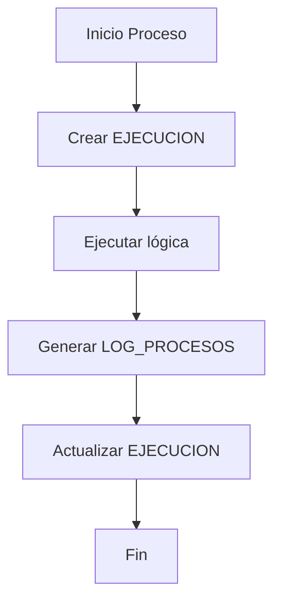

# DOCUMENTACIÓN:            Sistema de Auditoría de Automatizaciones

# Objetivo

El objetivo de este estándar es **centralizar la trazabilidad y monitoreo** de los procesos automatizados en una infraestructura única.

Se busca:

- Eliminar dependencia de logs locales disperso
- Permitir auditoria centralizada
- Analizar volúmenes de procesamiento
- Facilitar debugging y soporte operativo

# Modelo de Datos (DER)



El sistema se basa en una arquitectura de tres niveles, separando **definición del proceso, su ejecución** y el **detalle de lo ocurrido** en cada corrida.

# Estructura de Auditoría

## **PROCESOS →** Definición del proceso

Representa el catálogo de automatizaciones disponibles

- Cada registro corresponde a un **bot/automatizador/proceso** de forma única
- Contiene:
    - Nombre del proceso
    - Descripción de lo que hace

### EJEMPLO

| id_proceso | nombre_proceso | descripcion_proceso |
| --- | --- | --- |
| 1 | BOT_SEGUROS | Sincroniza operaciones de seguros MySQL -> Google Sheets |
| 2 | BOT_STOCK_WEB | Publica stock de unidades en portal web de concesionaria |

## **EJECUCIÓN →** Registro de cada corrida

- Cada vez que un proceso se ejecuta, se genera un nuevo registro.
- Permite conocer:
    - Fecha de inicio y fin
    - Estado de ejecución (`EXITO`, `ERROR`, `ADVERTENCIA`)
- Resumen de ejecución

Esta entidad permite:

- Medir tiempos de ejecución
    - A partir de `fecha_inicio` y  `fecha_fin` es posible identificar demoras y mejorar performance del proceso
- Detectar fallos
    - A través del campo `estado`

Es importante que `resumen` tenga síntesis clara, por ejemplo

> `10 INSERT, 2 UPDATE, 1 ERROR`
> 

### EJEMPLO

| id_ejecucion | id_proceso | fecha_inicio | fecha_fin | resumen | estado |
| --- | --- | --- | --- | --- | --- |
| 1001 | 1 | 2026-04-10 17:13:19 | 2026-04-10 17:13:23 | 10 INSERT, 0 UPDATE, 0 ERROR | EXITO |
| 1002 | 1 | - | - | 3 INSERT, 2 UPDATE, 1 ERROR | ERROR |
| 2001 | 2 |  |  | 25 INSERT, 12 UPDATE, 0 ERROR |  |

## **LOG_PROCESOS → Detalle de ejecución**

Contiene el detalle completo de lo ocurrido durante la ejecución.

- Cada registro está asociado a una ejecución `id_ejecución`
- El campo `detalle` almacena un **log estructurado en formato texto**
    
    **Este campo debe:**
    
    - Estar correctamente redactado
    - Reflejar las acciones realizadas por el proceso
    - Permitir auditoría manual sin necesidad de consultar otras fuentes

**Regla de negocio a seguir:**

- Se registra **un único log por ejecución**
- No se deben generar múltiples filas por evento
- El campo **`detalle`**debe contener información **clara, estructurada y útil para auditoría**

**Ejemplo de `detalle`**

```bash
[INICIO] 2026-04-10 17:13:19
[RESUMEN] extraidos=14, deduplicados=10, inserts=10, updates=0, errores=0
[INSERT] 26030005, 26030021, 26030020, 26030022, 26030032, 26030040
[UPDATE] 26020061 (2 campos), 26030076 (1 campo)
 - 26020061.Precioventa: '32,391,000.00' -> '32391000'
 - 26020061.Patente: '' -> 'AI091HC'
 - 26030076.Estadoavance: 'Autorizado' -> 'Facturada'
 [FIN] EXITO
```

### EJEMPLO

| id_log | id_ejecucion | detalle |
| --- | --- | --- |
| 5001 | 1001 | [INICIO] 2026-04-10 17:13:19
[RESUMEN] extraidos=14, deduplicados=10, inserts=10, updates=0, errores=0
[INSERT] 26030005, 26030021, 26030020, 26030022, 26030032, 26030040
[FIN] EXITO |
| 5002 | 1002 | [INICIO] 2026-04-10 17:18:10
[RESUMEN] extraidos=7, deduplicados=5, inserts=3, updates=2, errores=1
[INSERT] 26030043, 26020085, 26030006
[UPDATE] 26020061 (9 campos), 26030076 (3 campos)
26020061.Precioventa: '32,391,000.00' -> '32391000'
26020061.Patente: '' -> 'AI091HC'
[ERROR] APIError 400 batch_update: Unable to parse range A9:AA9
[FIN] ERROR |

# Flujo de auditoria



# Convención de logs

Con el fin de mantener `detalle` idénticos entre todas las automatizaciones, el campo debe seguir una estructura de texto clara y consistente

**Recomendaciones:** 

- `[INICIO]` → inicio de la ejecución
- `[RESUMEN]` → métricas generales del proceso
- `[INSERT]` → registros insertados
- `[UPDATE]` → registros actualizados
- `[DELETE]` → registros eliminados, si aplica
- `[ERROR]` → errores detectados durante la ejecución
- `[FIN]` → cierre del proceso con estado final

**Reglas**

- Utilizar mismo formato entre procesos
- Redactar de forma clara y breve la acción tomada por el automatizador

**Ejemplo**

```bash
[INICIO] 2026-04-10 17:13:19
[RESUMEN] extraidos=14, deduplicados=10, inserts=10, updates=0, errores=0
[INSERT] 26030005, 26030021, 26030020
[UPDATE] 26020061 (2 campos)
 - 26020061.Patente: '' -> 'AI091HC'
[FIN] EXITO
```

**Ejemplo con error**

```bash
[INICIO] 2026-04-14 11:05:12
[RESUMEN] procesados=25, publicados=18, actualizados=5, errores=2

[INSERT] VEH_1023, VEH_1045, VEH_1098
[UPDATE] VEH_0871 (2 campos), VEH_0912 (1 campo)
 - VEH_0871.Precio: '12500000' -> '12350000'
 - VEH_0871.Disponibilidad: 'Reservado' -> 'Disponible'
 - VEH_0912.Kilometraje: '0' -> '15'

[ERROR] VEH_1102: Error al publicar en API Web (HTTP 500 - Internal Server Error)
[ERROR] VEH_1110: Timeout al intentar conexión con servicio de publicación

[FIN] ERROR
```

# Manejo de errores

Las automatizaciones no usaran rollback automático, en caso de fallo durante la ejecución de un proceso.

En su lugar, se adopta el siguiente comportamiento en caso de errores:

- Los cambios realizados correctamente se **mantienen**
- Los errores ocurridos se registran en el log `LOG_PROCESOS.detalle`
- El estado final de ejecución reflejará el resultado `ERROR` o `ADVERTENCIA`
- La revisión y corrección queda a cargo del responsable de auditoría
    
    <aside>
    💡
    
    Este comportamiento puede cambiar si se implementa un mecanismo de notificaciones.
    
    </aside>
    

## **Ejemplo**

Un proceso puede:

- Insertar correctamente varios registros
- Fallar en algunos casos puntuales
- Finalizar con estado `ERROR`

En este escenario:

- Los registros exitosos permanecen en el sistema
- Los errores quedan documentados en el log
- El encargado de auditoría o supervisión podrá identificar y corregir los casos fallidos

# Queries de Auditoría

## Ejecuciones del día

Consultar procesos que se ejecutaron hoy, en qué estado finalizaro y cuál fue su resumen

```sql
SELECT 
    p.nombre_proceso,
    e.id_ejecucion,
    e.fecha_inicio,
    e.fecha_fin,
    e.estado,
    e.resumen
FROM EJECUCION e
JOIN PROCESOS p ON e.id_proceso = p.id_proceso
WHERE DATE(e.fecha_inicio) = CURDATE()
ORDER BY e.fecha_inicio DESC;
```

## Ejecuciones con error

Identificar rápidamente que procesos finalizaron con estado `ERROR`

```sql
SELECT 
    p.nombre_proceso,
    e.id_ejecucion,
    e.fecha_inicio,
    e.fecha_fin,
    e.estado,
    e.resumen
FROM EJECUCION e
JOIN PROCESOS p ON e.id_proceso = p.id_proceso
WHERE e.estado = 'ERROR'
ORDER BY e.fecha_inicio DESC;

```

## Ejecuciones con advertencia

Identificar procesos que finalizaron con comportamiento parcial o con observaciones.

```sql
SELECT 
    p.nombre_proceso,
    e.id_ejecucion,
    e.fecha_inicio,
    e.fecha_fin,
    e.estado,
    e.resumen
FROM EJECUCION e
JOIN PROCESOS p ON e.id_proceso = p.id_proceso
WHERE e.estado = 'ADVERTENCIA'
ORDER BY e.fecha_inicio DESC;
```

## Detalle completo de una ejecución

Consultar log completo almacenado en `LOG_PROCESOS` para una ejecución puntual.

```sql
SELECT 
    p.nombre_proceso,
    e.id_ejecucion,
    e.fecha_inicio,
    e.fecha_fin,
    e.estado,
    e.resumen,
    l.detalle
FROM EJECUCION e
JOIN PROCESOS p ON e.id_proceso = p.id_proceso
JOIN LOG_PROCESOS l ON e.id_ejecucion = l.id_ejecucion
WHERE e.id_ejecucion = 1;
```

> Remplazar `id_ejecucion` de la que se quiere auditar
> 

## Duración de ejecuciones

Medir cuánto tardó cada proceso y detectar posibles problemas de performance

### Duración de ejecuciones de hoy

```sql
SELECT 
    p.nombre_proceso,
    e.id_ejecucion,
    e.fecha_inicio,
    e.fecha_fin,
    TIMESTAMPDIFF(SECOND, e.fecha_inicio, e.fecha_fin) AS duracion_segundos,
    e.estado
FROM EJECUCION e
JOIN PROCESOS p ON e.id_proceso = p.id_proceso
WHERE e.fecha_fin IS NOT NULL
ORDER BY e.fecha_inicio DESC;
```

### Duración de ejecuciones en una fecha específica

```sql
SELECT 
    p.nombre_proceso,
    e.id_ejecucion,
    e.fecha_inicio,
    e.fecha_fin,
    TIMESTAMPDIFF(SECOND, e.fecha_inicio, e.fecha_fin) AS duracion_segundos,
    e.estado
FROM EJECUCION e
JOIN PROCESOS p ON e.id_proceso = p.id_proceso
WHERE e.fecha_fin IS NOT NULL
  AND DATE(e.fecha_inicio) = '2026-04-14'
ORDER BY e.fecha_inicio DESC;
```

> Remplazar `'2026-04-14'` por fecha a consultar
> 

### Duración de ejecuciones en un período de tiempo

```sql
SELECT 
    p.nombre_proceso,
    e.id_ejecucion,
    e.fecha_inicio,
    e.fecha_fin,
    TIMESTAMPDIFF(SECOND, e.fecha_inicio, e.fecha_fin) AS duracion_segundos,
    e.estado
FROM EJECUCION e
JOIN PROCESOS p ON e.id_proceso = p.id_proceso
WHERE e.fecha_fin IS NOT NULL
  AND e.fecha_inicio >= '2026-04-01 00:00:00'
  AND e.fecha_inicio <  '2026-04-15 00:00:00'
ORDER BY e.fecha_inicio DESC;
```