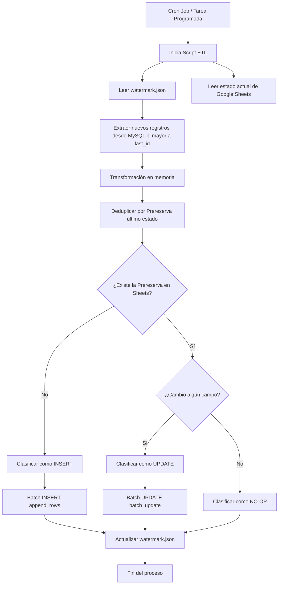

# README

# **ETL de Seguros: sincronización de MySQL a Google Sheets**

Este proyecto sincroniza el **historial de operaciones de ventas,** transformando datos transaccionales almacenados en **MySQL** en una vista organizada en **Google Sheet**

El sistema permite **rastrear la evolución de cada operación en el tiempo,** reflejando de forma automática cada **cambio de estado:**

> — desde la **prereserva inicial** hasta la **facturación y entrega final** —
> 

De esta manera, se asegura que la información esté siempre actualizada, sea consistente y no dependa de procesos manuales de lectura.

## ¿Qué hace actualmente el sistema?

El programa funciona de forma incremental, procesando únicamente **datos nuevos** y **manteniendo una vista actualizada** en **Google Sheets.**

**Funcionamiento**

- **Detecta nuevos registros en la base de datos**
    - Solo procesa operaciones que no fueron tratadas, utiliza la última `id` procesada guardada en un `watermark.json`
    - La lectura de la última id procesada, permite hacer un `SELECT` en la base de datos filtrando solo nuevos logs transaccionales.
    
    > **Nota:** Está previsto reducir la dependencia de `watermark.json`
    > 
- **Reconstruye el estado más reciente de cada operación**
    - Si una misma **Prereserva** aparece varias veces (por cambios de estado), el sistema conserva únicamente la versión más actual.
- **Decide que hacer con cada registro**
    - Para cada operación, compara lo que ya existe en **Google Sheets** y determina:
        - Insertar un nuevo registro si no existe
        - Actualizarlo si hubo cambios
        - Ignorarlo si no cambio nada
- **Hojas listas para uso operativo**
    - Asegura que exista un encabezado correcto
    - Mantiene filtros activos para facilitar el uso
    - Si esta configuración falla, **no afecta los datos**, solo la presentación

## Flujo del BOT



## 🛠️ Instalación Local

1. **Clonar el repositorio o descargar los archivos**:
Asegúrate de tener en tu carpeta: `etl.py`, `requirements.txt` y `.env.example`.
2. **Crear y activar un entorno virtual**:
    
    ```bash
    python -m venv venv
    # En Windows:
    .\venv\Scripts\activate
    # En Linux/macOS:
    source venv/bin/activate
    ```
    
3. **Instalar dependencias**:
    
    ```bash
    pip install -r requirements.txt
    ```

### Dependencias Linux para SQL Server (pyodbc + ODBC)

Si ejecutas el ETL en Linux para extraccion productiva desde SQL Server, ademas de `pip install -r requirements.txt` necesitas instalar dependencias del sistema operativo.

#### Ubuntu/Debian (recomendado)

Si ejecutas como `root`, usa los comandos sin `sudo`.

```bash
apt-get update
apt-get install -y curl ca-certificates gnupg apt-transport-https unixodbc unixodbc-dev
curl -sSL https://packages.microsoft.com/config/ubuntu/24.04/packages-microsoft-prod.deb -o /tmp/packages-microsoft-prod.deb
dpkg -i /tmp/packages-microsoft-prod.deb
rm -f /tmp/packages-microsoft-prod.deb
apt-get update
ACCEPT_EULA=Y apt-get install -y msodbcsql18
```

> Si usas otra version de Ubuntu, reemplaza `24.04` en la URL por tu version.

#### Verificacion rapida

```bash
python -c "import pyodbc; print(pyodbc.drivers())"
```

Debe aparecer al menos uno de estos drivers:
- `ODBC Driver 18 for SQL Server`
- `ODBC Driver 17 for SQL Server`

Si la salida es `[]`, el ETL en modo produccion no podra conectarse a SQL Server.
    
4. **Configurar variables de entorno**:
Copia el archivo de ejemplo y edítalo con tus credenciales reales:
    
    ```bash
    cp .env.example .env
    ```
    
    *Nota: En Windows usa `copy .env.example .env`.*
    
5. **Añadir credenciales de Google**:
Coloca tu archivo `credentials.json` en la raíz del proyecto.

## Ejecución del ETL

El programa se puede ejecutar manualmente o configurarse para que funcione de forma automática.

### **✔ Ejecución manual**

```bash
python etl.py
```

Esto ejecuta el ciclo completo del ETL:

- Detectar registros en base de datos
- Procesar cambios
- Actualizar el Google Sheet

### ✔ Ejecución automática (Cron Job Linux)

Configuración **cron job** para que corra cada 15 minutos:

```bash
crontab -e
```

En caso de pasarlo a entorno productivo, 

```
*/15 * * * * /ruta/al/proyecto/venv/bin/python /ruta/al/proyecto/etl.py
```

## 📂 Estructura de Archivos

- `etl.py`
    - Script principal del sistema. Contiene toda la lógica del proceso ETL:
        - **Extracción** desde MySQL
        - **Transformación** de datos
        - **Actualización** en Google Sheets
- `watermark.json`: Almacena el último `id` procesado. Permite al programa continuar donde se quedo en la ejecución anterior.
- `etl.log`: Archivo de logs donde se registra cada ejecución del proceso, incluyendo errores y acciones realizadas.
- `credentials.json`: Llave de acceso a la API de Google
- `.env`: Archivo de configuración con variables sensibles (credenciales de base de datos, IDs de Sheets, etc.).

## 🧪 Testing del Sistema

El proyecto incluye un simulador, el cual permite generar datos y validar comportamiento del ETL en distintos escenarios.

### Simulador de Concesionaria

El script `test/simulador_concesionaria.py` simula el comportamiento de un sistema transaccional real.

**Permite:**

- Generar operaciones nuevas
    - Crear clientes referenciados con (Prerservas)
- Simular **cambios de estado** en el tiempo
    - Ya sea cambios como Fecha de Patentamiento, Corrección de nombres de personas
- Preparado para simular cualquier tipo de cambios que ocurran en la vida real.

## Modo de Uso

### ✔Modo interactivo

```bash
python .\test\simulador_concesionaria.py--interactive
```

Abre un asistente en consola que guía paso a paso la configuración de la simulación.

### ✔ Modo prueba (sin base de datos)

```bash
python .\test\simulador_concesionaria.py--source faker--mode log--new-count5--repeat-count3
```

- No escribe en MySQL
- Muestra los eventos generados en consola
- Ideal para entender qué datos se generan

### 💾 Modo inyección (base de datos)

```bash
python .\test\simulador_concesionaria.py--source faker--mode db--new-count50--repeat-count25--delay2
```

- Inserta datos en MySQL
- Simula el uso real del sistema

### ⏪ Modo replay (datos históricos) - RECOMENDADO

```
python .\test\simulador_concesionaria.py--source replay--mode db--new-count20--repeat-count15--delay1
```

- Reproduce datos reales desde un archivo
    - Se utiliza un dataset de reportes reales viejos de la empresa para el testing
- Permite testear el ETL con escenarios más cercanos a producción

## 🧩 Parámetros principales

- `-source`: `faker` (datos simulados) o `replay` (histórico)
- `-mode`: `log` (solo consola) o `db` (inserta en MySQL)
- `-new-count`: cantidad de operaciones nuevas
- `-repeat-count`: cantidad de eventos repetidos (evolución de estado)
- `-delay`: pausa entre eventos (simulación en tiempo real)
- `-seed`: fija resultados reproducibles
- `-reset-table`: reinicia la tabla de testing
- `-interactive`: modo guiado por consola
- `-replay-file`: archivo de entrada para modo replay

## Flujo de Pruebas

Pasos recomendados para realizar el testing

### 1. Resetear la base de datos de testing

```bash
python .\test\simulador_concesionaria.py --reset-table
```

Reinicia la tabla `Seguros` (el `id` vuelve a 1).

### 2. Generar datos iniciales

```bash
python .\test\simulador_concesionaria.py --source replay --mode db --new-count 20 --repeat-count 10 --delay 0
```

Simula operaciones nuevas y algunos cambios de estado.

### 3. Ejecutar el ETL

```
python etl.py
```

Procesa los datos y los sincroniza con Google Sheets.
