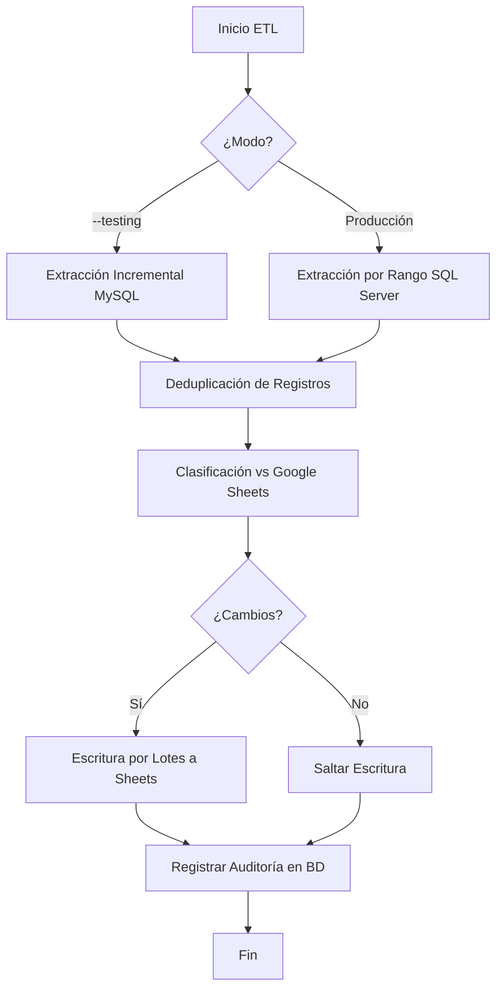
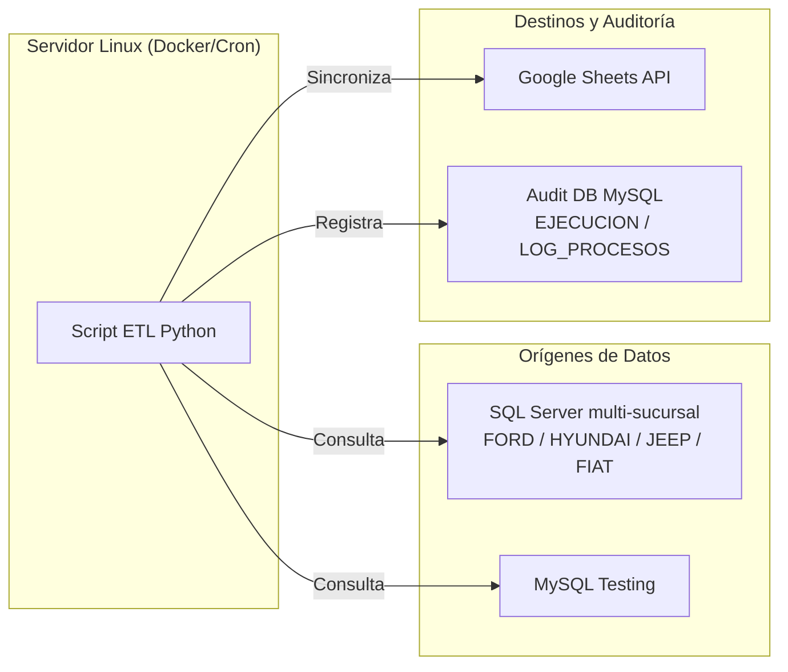
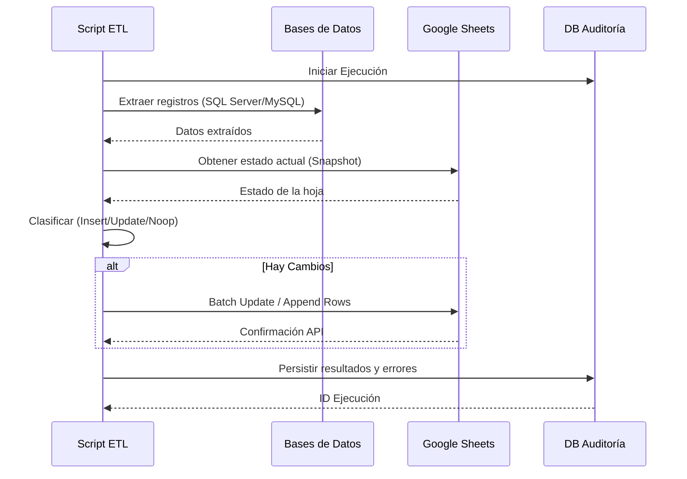

# ETL de Seguros: sincronizacion hacia Google Sheets

Este proyecto sincroniza operaciones de seguros hacia Google Sheets para uso operativo diario.

El ETL soporta dos modos:

- `--testing`: extraccion incremental desde MySQL con `watermark.json`.
- Produccion (default): extraccion desde SQL Server multi-sucursal por rango de `FechaPrereserva`.

## Indice rapido

- [Alcance funcional actual](#alcance-funcional-actual)
- [Reglas de datos relevantes](#reglas-de-datos-relevantes)
- [Estructura del proyecto](#estructura-del-proyecto)
- [Requisitos](#requisitos)
- [Ejecucion](#ejecucion)
  - [Manual](#manual-desde-automatizacionesetl_seguros)
  - [Docker](#docker-recomendado-en-servidor-linux)
  - [Ejecucion automatica con cron](#ejecucion-automatica-con-cron)
- [Validacion de fechas de parametros](#validacion-de-fechas-de-parametros)
- [Auditoria operativa](#auditoria-operativa)
- [Estilizado de Google Sheets](#estilizado-de-google-sheets)
- [Testing con simulador](#testing-con-simulador)
- [Troubleshooting rapido](#troubleshooting-rapido)
- [Flujo y arquitectura de la automatizacion](#flujo-y-arquitectura-de-la-automatizacion)

## Inicio rapido

1. Configurar `.env` y `credentials.json`.
2. Ejecutar dry-run productivo:

```bash
python etl.py --start-date 20260201 --end-date 20260301 --dry-run
```

3. Ejecutar corrida real:

```bash
python etl.py --start-date 20260201 --end-date 20260301
```

## Flujo y arquitectura de la automatizacion

Esta seccion detalla visualmente como opera el script, sus componentes y el viaje de los datos.

### Diagrama de flujo operativo



### Arquitectura y componentes



### Secuencia de sincronización de datos



## Alcance funcional actual

- Extraccion multi-sucursal en produccion desde vistas `dbo.Vista_Seguros`.
- Marca de origen por sucursal generada por ETL: `FORD`, `HYUNDAI`, `JEEP`, `FIAT`.
- Deduplicacion por clave compuesta de negocio: `Prereserva + Sucursal_origen`.
- Clasificacion de cambios contra Google Sheets: `INSERT`, `UPDATE`, `NOOP`.
- Escritura por lotes con reintentos ante errores API (429/5xx).
- Auditoria transaccional en BD (`PROCESOS`, `EJECUCION`, `LOG_PROCESOS`).

## Reglas de datos relevantes

- `Sucursal_origen` no viene de la vista: la crea el ETL segun la base consultada.
- Fechas operativas (`FechaEntrega`, `FechaPrereserva`, `FechaVenta`) se escriben en Sheets como `dd/mm/yyyy`.
- Si una fecha de origen es invalida, se conserva texto original y se registra warning.
- `PrecioVenta` se normaliza para evitar diferencias de formato al comparar.

## Estructura del proyecto

```text
/Entorno
├── automatizaciones/
│   └── etl_seguros/
│       ├── etl.py
│       ├── test/
│       └── dataset/
├── core/
│   ├── db_utils.py
│   └── audit_logger.py
├── deploy/
│   └── etl_seguros/
├── docs/
└── scripts/
    └── sheet_styling_seguros.py
```

## Requisitos

1. Python y entorno virtual.
2. Dependencias Python:

```bash
pip install -r requirements.txt
```

3. Variables de entorno (`.env`) basadas en `.env.example`.
4. Credenciales de Google (`credentials.json`) compartidas con el spreadsheet.

### Dependencias Linux para SQL Server (produccion)

Si se ejecuta en Linux con SQL Server:

```bash
apt-get update
apt-get install -y curl ca-certificates gnupg apt-transport-https unixodbc unixodbc-dev
curl -sSL https://packages.microsoft.com/config/ubuntu/24.04/packages-microsoft-prod.deb -o /tmp/packages-microsoft-prod.deb
dpkg -i /tmp/packages-microsoft-prod.deb
rm -f /tmp/packages-microsoft-prod.deb
apt-get update
ACCEPT_EULA=Y apt-get install -y msodbcsql18
```

Verificacion rapida:

```bash
python -c "import pyodbc; print(pyodbc.drivers())"
```

Debe aparecer al menos `ODBC Driver 18 for SQL Server` o `ODBC Driver 17 for SQL Server`.

## Ejecucion

### Manual (desde `automatizaciones/etl_seguros`)

Ejecucion productiva por defecto (si no se pasan fechas, usa hoy-hoy):

```bash
python etl.py
```

Ejecucion productiva por rango:

```bash
python etl.py --start-date YYYYMMDD --end-date YYYYMMDD
```

Ejemplo:

```bash
python etl.py --start-date 20260201 --end-date 20260301
```

Simulacion sin escritura en Sheets:

```bash
python etl.py --start-date 20260201 --end-date 20260301 --dry-run
```

Modo testing incremental (MySQL):

```bash
python etl.py --testing
```

Reset de watermark en testing:

```bash
python etl.py --testing --reset-watermark
```

### Docker (recomendado en servidor Linux)

Desde la raiz `Entorno/`:

1. Build de imagen (compila/prepara el contenedor en la maquina donde se va a usar):

```bash
docker compose -f deploy/etl_seguros/docker-compose.yml build
```

2. Ver ayuda del script dentro del contenedor (lista parametros disponibles y forma de uso):

```bash
docker compose -f deploy/etl_seguros/docker-compose.yml run --rm etl_seguros_bot --help
```

3. Ejecutar ETL productivo por rango de fechas (`--start-date` y `--end-date`):

```bash
docker compose -f deploy/etl_seguros/docker-compose.yml run --rm etl_seguros_bot --start-date 20260201 --end-date 20260301
```

4. Ejecutar ETL sin parametros (en produccion usa fecha actual):

```bash
docker compose -f deploy/etl_seguros/docker-compose.yml run --rm etl_seguros_bot
```

## Ejecucion automatica con cron

Para programar ejecucion automatica en Linux:

1. Editar cron:

```bash
crontab -e
```

2. Agregar jobs con `flock` para evitar corridas superpuestas:

```cron
# Ejecuta cada 30 minutos entre 08:00 y 17:30 (Lunes a Viernes) -> en caso de horarios argentina, revisar cronjob
0,30 11-20 * * 1-5 /usr/bin/flock -n /tmp/etl_seguros.lock -c 'cd /var/www/seguros && /usr/bin/docker compose -f deploy/etl_seguros/docker-compose.yml run --rm etl_seguros_bot >> runtime/etl_seguros/cron.log 2>&1'

# Ejecuta la ultima pasada exactamente a las 18:00 (Lunes a Viernes)
0 21 * * 1-5 /usr/bin/flock -n /tmp/etl_seguros.lock -c 'cd /var/www/seguros && /usr/bin/docker compose -f deploy/etl_seguros/docker-compose.yml run --rm etl_seguros_bot --start-date 20260101 >> runtime/etl_seguros/cron.log 2>&1'
```

Notas:

- Ajustar `/home/Entorno` al path real del servidor.
- `flock` evita que una nueva corrida inicie si la anterior sigue en ejecucion.
- El log de cron en este ejemplo queda en `runtime/etl_seguros/cron.log`.

## Validacion de fechas de parametros

Los parametros `--start-date` y `--end-date` validan:

- Formato `YYYYMMDD`.
- Fecha calendario valida.

Ejemplo invalido:

- `20260230` falla porque el dia no existe.

## Auditoria operativa

Cada corrida persiste:

- Registro de ejecucion con resumen y estado final.
- Detalle de eventos por fuentes, inserts, updates, warnings y errores.

Estados posibles:

- `EXITO`
- `ADVERTENCIA`
- `ERROR`

## Estilizado de Google Sheets

Script disponible:

```bash
python scripts/sheet_styling_seguros.py
```

Acciones del script:

- Tipografia Arial y encabezado operativo.
- Freeze fila 1 y columnas `A:F`.
- Banding blanco/gris alternado.
- Color de fila completa por estado en `Vendido / No vendido`.
- Validaciones para columnas de contacto y estado.
- Ajustes de ancho de columnas y wrap en `Email`/`Domicilio`.
- Ejecucion idempotente (limpia banding/reglas previas antes de aplicar).

## Testing con simulador

Script:

`automatizaciones/etl_seguros/test/simulador_concesionaria.py`

Este simulador permite generar actividad de concesionaria sin depender de la base real de produccion.
Su objetivo es poblar/estresar el flujo de testing del ETL con operaciones nuevas y cambios de estado.

Conceptos principales:

- `--source faker`: genera usuarios y operaciones al azar.
- `--source replay`: reutiliza datos existentes de ejemplo (historicos) para repetir escenarios realistas.
- `--mode db`: inserta los registros generados en la base de datos de testing.
- `--mode log`: no inserta en base, solo muestra/loguea los datos creados.
- `--new-count`: cantidad de prereservas nuevas a crear (inserts iniciales).
- `--repeat-count`: cantidad de prereservas/usuarios que tendran eventos de cambio de estado.

Recomendacion:

- Ejecutar siempre `--mode db` contra una base dedicada de testing, nunca contra produccion.

Ejemplos:

Modo interactivo:

```bash
python .\test\simulador_concesionaria.py --interactive
```

Modo log sin base de datos:

```bash
python .\test\simulador_concesionaria.py --source faker --mode log --new-count 5 --repeat-count 3
```

Modo DB con replay:

```bash
python .\test\simulador_concesionaria.py --source replay --mode db --new-count 20 --repeat-count 15 --delay 1
```

## Troubleshooting rapido

- Error `Spreadsheet not found (404)`: revisar `SPREADSHEET_ID` y permisos de la cuenta de servicio.
- Error `Worksheet not found`: revisar `SHEET_NAME`.
- Error ODBC en Linux: instalar `msodbcsql18` y `unixodbc`, validar `pyodbc.drivers()`.
- Muchos `INSERT` en `dry-run`: suele indicar hoja vacia o registros aun no presentes para ese rango.
